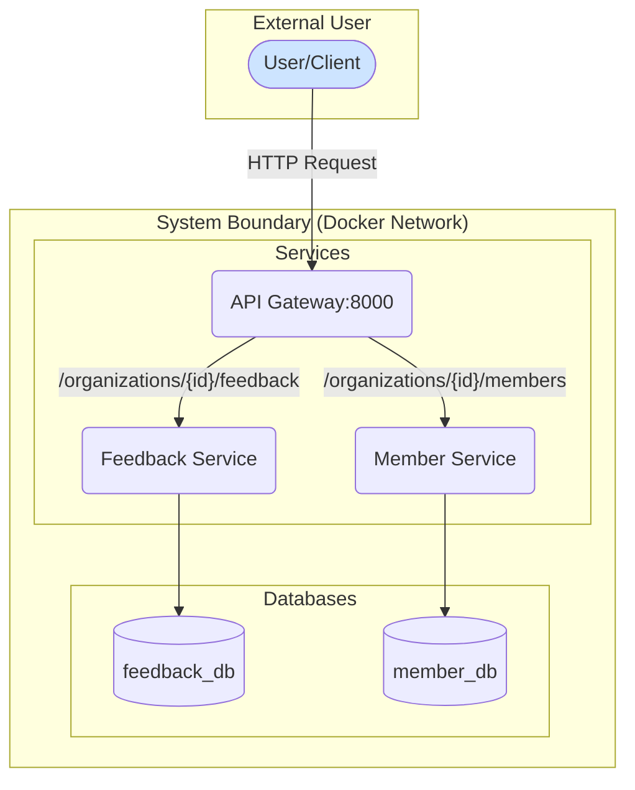

# TalentManagement Microservices Platform

This project implements a microservice-based system as part of a technical leadership assignment. It features a `Feedback Service` for managing company feedback and a `Member Service` for managing organization members, with a `Gateway Service` acting as a single entry point.

The solution is designed with a focus on clean architecture, separation of concerns, and production-ready practices, including configuration management, containerization, and a RESTful API design.

## Architecture Overview

The system is composed of three services that run in separate Docker containers and communicate over a shared Docker network. All external traffic is routed through a single API Gateway.



- **API Gateway (`gateway`):** The single entrypoint for all API requests. It validates the request path and proxies it to the appropriate internal service. It is the only service exposed to the host machine.
- **Feedback Service (`feedback_service`):** Manages all create, read, and delete operations for feedback records.
- **Member Service (`member_service`):** Manages all create, read, and delete operations for organization members.
- **PostgreSQL (`db`):** A single PostgreSQL instance that hosts two separate databases (`feedback_db` and `member_db`) to ensure data isolation between services.

## Setup and Running the System

### Prerequisites

- Docker and Docker Compose must be installed on your system.

### 1. Environment Configuration

Each service uses its own `.env` file for configuration, loaded by Docker Compose. Create these files from the provided examples:

```bash
# For the Gateway
cp services/gateway/env.example services/gateway/.env

# For the Feedback Service
cp services/feedback_service/env.example services/feedback_service/.env

# For the Member Service
cp services/member_service/env.example services/member_service/.env
```

#### Environment Variables
The default values are configured to work within the Docker network.

| Service            | Variable                  | Description                                            | Default Value                     |
| ------------------ | ------------------------- | ------------------------------------------------------ | --------------------------------- |
| `gateway`          | `FEEDBACK_SERVICE_URL`    | URL for the internal feedback service.                 | `http://feedback_service:8001`    |
| `gateway`          | `MEMBER_SERVICE_URL`      | URL for the internal member service.                   | `http://member_service:8002`      |
| `feedback_service` | `DATABASE_URL`            | Connection string for the feedback database.           | `postgresql://user:password@db:5432/feedback_db` |
| `feedback_service` | `DEFAULT_ORGANIZATION_ID` | The default organization ID for operations.            | `8a1a7ac2-e528-4e63-8e2c-3a37d1472e35` |
| `member_service`   | `DATABASE_URL`            | Connection string for the member database.             | `postgresql://user:password@db:5432/member_db`   |
| `member_service`   | `DEFAULT_ORGANIZATION_ID` | The default organization ID for operations.            | `8a1a7ac2-e528-4e63-8e2c-3a37d1472e35` |

### 2. Build and Run the Services

The entire application stack can be launched using a single command:

```bash
docker-compose up --build
```

This command builds the images, starts all containers, and connects them. The services will be available at:

- **Gateway / API:** `http://localhost:8000` (All API requests go here)
- **PostgreSQL Database:** `localhost:5432`

### 3. Seed Sample Data

With the services running, populate the database with sample data by opening a new terminal and running:

```bash
./scripts/seed-db.sh
```

## API Documentation

The API is designed to be RESTful, using the organization as the root resource for members and feedback. All requests are made through the **Gateway** at `http://localhost:8000`.

A default organization ID is used for this assignment: `8a1a7ac2-e528-4e63-8e2c-3a37d1472e35`.

### Endpoints

#### Feedback Service
- `POST /organizations/{org_id}/feedback`: Create feedback for an organization.
- `GET /organizations/{org_id}/feedback`: Get all feedback for an organization.
- `DELETE /organizations/{org_id}/feedback`: Soft-delete all feedback for an organization.

#### Member Service
- `POST /organizations/{org_id}/members`: Create a new member for an organization.
- `GET /organizations/{org_id}/members`: Get all members of an organization.
- `DELETE /organizations/{org_id}/members`: Soft-delete all members of an organization.

### Interactive Swagger Documentation

For detailed, interactive documentation, please visit the Swagger UI endpoints once the services are running. This provides a full view of all endpoints, schemas, and allows for direct API interaction.

- **Gateway (Consolidated View):** `http://localhost:8000/docs`
- **Feedback Service (Direct):** `http://localhost:8001/docs`
- **Member Service (Direct):** `http://localhost:8002/docs`

## How to Run Tests

The project includes a comprehensive test suite using `pytest`. The tests are containerized and can be run with a single command:

```bash
docker-compose run --rm tests
```

This command will start a temporary container, install test dependencies, and run all unit and integration tests against the running services.

## Key Architectural Decisions

- **RESTful Design:** The API uses a hierarchical, RESTful structure (`/organizations/{id}/members`) to create a logical and scalable design, prioritizing this over the simplified endpoint examples in the specification to demonstrate a more robust architectural approach.
- **Configuration Management:** Uses Pydantic Settings for type-safe configuration. Each microservice has its own `.env` file for isolated, environment-specific configuration, loaded via `docker-compose`.
- **Gateway Routing:** The gateway uses specific route definitions rather than a generic catch-all proxy. This provides a more secure and explicit API contract at the entrypoint.
- **Soft Deletes:** All delete operations are soft deletes (`deleted_at` timestamp), preserving data history and preventing accidental data loss. This is implemented at the service level by filtering all read queries and updating the timestamp on delete queries.
